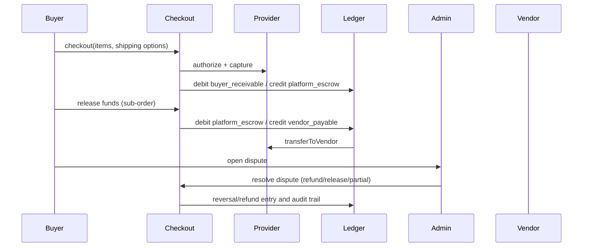

# MarketPlace (Laravel 11)

## Domain model and schema overview

- Roles: `admin`, `vendor`, `buyer`, `moderator/support`.
- User profiles include avatar and bio.
- Social trust: favorites (items/vendors), ratings (stars + feedback), reports, and blocks.
- Catalog: categories/tags/products/variants with search, inventory, and moderation-ready status.
- Checkout: multi-vendor split with per-vendor shipping methods/options.
- Escrow: auditable double-entry ledger with buyer release + dispute refund flows.
- Messaging: buyer↔vendor thread per sub-order with attachment scan hook and report/flag path.
- Admin: dashboard KPIs + recent orders/disputes/reports for full operational moderation.

## Setup

```bash
cp .env.example .env
composer install
php artisan key:generate
php artisan migrate --seed
php artisan serve
```

### Docker

```bash
docker compose up -d
```

## API
- Base: `/api/v1`
- Includes products, ratings, favorites, shipping methods, checkout, messages, reports, disputes, escrow release, profile, block endpoints, and admin rate sync endpoint (`POST /api/v1/rates/sync`).
- OpenAPI spec: `docs/openapi.yaml`

## Pricing display
Products are exposed with display prices in **USD, GBP, EUR, and XMR** from `currency_rates`, with live refresh from external FX/XMR sources every 30 minutes (or on-demand via admin sync endpoint).

## Escrow flow



## Security highlights
- Encryption-at-rest for payout details and shipping/profile PII where applicable.
- Attachment uploads in private storage with malware scan hook job.
- Policies/Gates and block/report system to reduce abuse and IDOR risk.
- Immutable audit logs for escrow and dispute transitions.
